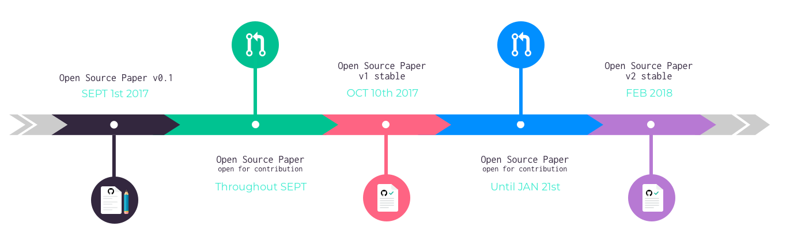

# Papers should be written like open source software

A paper is almost always a collective effort, from peer review to friends and family contributions. All of it matters and shapes its final version.

In the end, how a paper is made can be almost as important as its content. What were the sections that the authors struggled with? What kind of concerns a specific idea raised? All of these conversations in their own uniqueness helped guiding the progression of thought.

In our opinion, Git provides the perfect set of tools to visualize the work behind writing a paper. Through commits, pull requests and issues one can see who contributed, and in what way and what effect it had on the final version. In adittion, we see a paper like _The social smart contract_ to be a living document that is constantly updated and amended. As developers we know the documentation of democracy's evolution, like democracy itself, is always a work in progress.

We decided to use this technology to draft _The Social Smart Contract_ and we encourage others to join in to bring more transparency and collaboration to this process.

# Guidelines for contribution

## Timeframe

## How to contribute

### Using Github _Issues_

Use issues to:
- make general comments
- raise your concerns
- ask a question
- request more details, explanation

We will do our best to answer as fast as possible all issues created by the community.

If you are not familiar with Github, look up the [Github user guide to create an issue](https://help.github.com/articles/creating-an-issue/)

### Using _Pull requests_

Use pull requests to suggest modifications to the paper. Here are a few guidelines for pull request creation:
- Please make your edits following the wiki markup language [Mediawiki Formatting](https://www.mediawiki.org/wiki/Help:Formatting/en), they will be easier to merge that way.
- 1 pull request per change please.
- Give your pull request a subject/title that describes the edit.

We will do our best to address pull requests created by the community as quickly as possible. If the modification is a "no brainer" for reviewers we will merge it instantly, if not we will engage in a conversation with its creators to understand how best we can make use of his/her suggestions or explain why we are rejecting it.

If you are not familiar with Github look up the [Github user guide to create pull requests](https://help.github.com/articles/creating-a-pull-request/).
