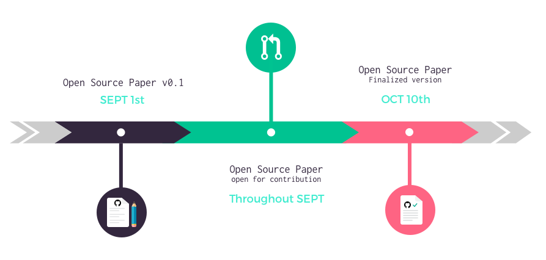

# Papers should be written like open source software

A paper is almost always a collective effort, from peer review to friends and family contributions all of it matters and shapes its final version.

In the end, how a paper is made is almost as interesting its content. What were the sections that the authors struggled with? What kind of concerns a specific idea raised? All of these conversations in their own unique helped refine those ideas and guided the progression of thought.

In our opinion, Git provides the perfect set of tools to visualize the work behind writing. From commits, to pull requests and through issues one can see who contributed, in what way and which effect it had on the final version.

We decided to use this technology to draft _The social smart contract_ and we encourage others to do the same to bring more transparency and collaboration to the shaping of their concepts and ideas. One could be surprised how amazing contributions from total strangers can be.

# Guidelines for contribution

## Timeframe

## How to contribute

### Using Github _Issues_

Use issues to :
- make general comments
- raise your concerns
- ask a question
- request more details, explaination

We will do our best to answer as fast as possible all issues created by the community.

If you are not familiar with Github, look up the [Github user guide to create an issue](https://help.github.com/articles/creating-an-issue/)

### Using _Pull requests_

Use pull request to suggest modification to the paper. Here are a few guidelines for pull request creation:
- We are using the [Mediawiki Formatting](https://www.mediawiki.org/wiki/Help:Formatting/en), please make your edits following the wiki markup language, this will allow us to merge without editing your PR.
- 1 pull request per change is easier for us to process

We will do our best to treat pull requests created by the community as fast as possible. If the modification is no brainer for reviewers we will merge instantly, if not we will engage a conversation with its creators to understand how best we can make use of its suggestions or explain why we are rejecting it.

If you are not familiar with Github look up the [Github user guide to create pull requests](https://help.github.com/articles/creating-a-pull-request/)
